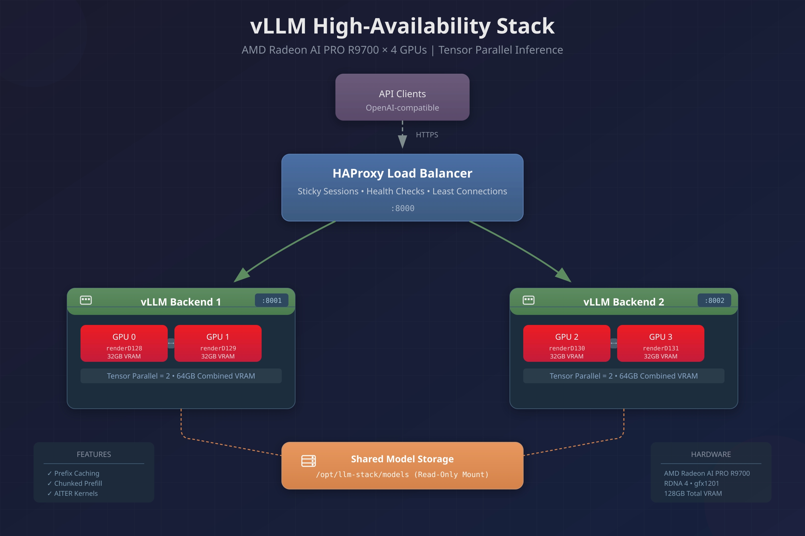
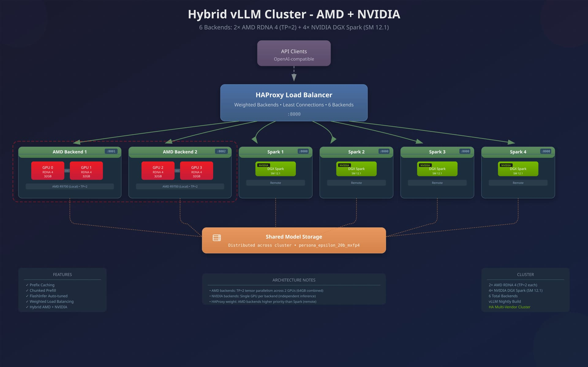

Posted by wendell on [the Level1Techs forum](https://forum.level1techs.com/t/4x-r9700-pro-setup-with-ha-proxy-for-failover-high-availability/244012).  It is the work of eousphoros.

# HAProxy-vLLM-bootstrap for AMD ROCm GPUs

## Local OpenAI-Compatible LLM Inference Endpoint with Redundancy

This is a **single-command bootstrap** for a local OpenAI-compatible LLM inference endpoint that offers redundancy.

- It spins up multiple vLLM backends (each bound to a subset of GPUs / tensor-parallel groups)
- It puts HAProxy in front as an API-layer load balancer + health checker + failover router
- It includes a bunch of the boring-but-important “production glue”: kernel/sysctl tuning, ulimits, THP disable, CPU governor, GPU power profiles, model download, and optional TLS.

The end result is: clients point at **one URL** (HAProxy), and you can lose a backend process (or even a GPU group) without your dev team’s “code assist” endpoint falling over.

This script is possible because of the Herculean efforts from @eousphoros and it’s been fun to be along for the ride here.

## Script Sections and How They Work

### 1) User-Tunable Variables

At the top you’ve got sane defaults, but everything important can be overridden via env vars:

- `STACK_DIR`, `MODEL_ID`, `MODEL_DIR`
- Ports: `LB_PORT`, `VLLM1_PORT`, `VLLM2_PORT`
- Backend GPU splits: `VLLM1_GPUS`, `VLLM2_GPUS`
- Isolation method: `GPU_ISOLATION=env|devices`
- vLLM tuning: `GPU_MEM_UTIL`, `MAX_MODEL_LEN`, `MAX_NUM_SEQS`, prefix caching, chunked prefill, dtype/kv dtype, etc.
- Optional TLS knobs: enable HTTPS + HTTP/2 with a local CA you generate.

(If you’re just skimming this as a quick start, don’t forget to also set your HF_TOKEN)

This should help make the script “portable” across boxes and across GPU configs without turning into a fork-per-system mess.

### Helper Functions

This is the “make it robust” section:

- Detect ROCm version / GPU count / ISA (`gfx1201`, `gfx942`, etc.)
- Pull a marketing name when possible (rocminfo)
- Estimate VRAM per GPU (useful for context limits / capacity expectations)
- Convert GPU indices into `/dev/dri/renderD*` mounts for the “devices mode” isolation.

The script can pick the right container image _and_ it can guide you when the system isn’t what you think it is (“expected 4 GPUs, found 3”).

It has been tested the most on our 4x R9700 system (temporary setup – as I’ve got to give two of those R9700s away!) as well as our RTX Pro 6000 systems.

### Real-World Aspects

This is the part most “LLM docker compose guides” totally ignore, and it’s why this script is actually useful for real-world workloads imho:

- Sets GPU power profile to COMPUTE and perf level **high**, plus a systemd unit to persist it
- Sets CPU governor to **performance**, plus a systemd unit to persist it
- Applies **sysctl** tuning for:
  - Connection-heavy workloads (backlogs, port range)
  - Keepalive + TIME_WAIT reuse
  - Bigger TCP buffers (LLM responses can be chunky)
  - BBR congestion control
  - VM/map count (large models map a lot)
  - Swappiness low (avoid latency death spirals)
  - Shared memory limits for RCCL/TP
- Disables **Transparent Huge Pages** (common latency spike source), persists via systemd
- Raises **ulimits** for file handles/processes and bumps Docker’s limits

Even on a single host, inference is “server software”, not “a Python script you run once”. This turns the workstation into something closer to an appliance.

Note that if this system is doing double-duty for VMs you might not want to disable THP, or maybe reserve some memory for your VMs up front to lower translation overhead. This was just something we followed from the vLLM tuning guide.

The script creates a venv solely to run HF CLI (imho this is a nice compromise vs polluting system’s python):

- Uses `HF_HOME` cache under the stack dir
- Supports `HF_TOKEN` without splatting it all over the compose file
- Downloads the model into `MODEL_DIR` and skips if already present (checks `config.json`)
- Excludes `original/*` to save space (pragmatic for vLLM use)

The model directory becomes a stable artifact you can back up, move, or share across setups. Technically I suppose you don’t need HF_TOKEN if you’ve already got the model you want.

### GPU Auto-Detection Chooses the Best vLLM ROCm Image

This is a killer feature:

- Reads GPU ISA and chooses a **GPU-specific optimized image** where available:
  - RDNA4 R9700 → `rocm/vllm-dev:open-r9700-...`
  - MI300 → `rocm/vllm-dev:open-mi300-...`
  - MI350 → `rocm/vllm-dev:open-mi355-...`
  - Falls back to `vllm/vllm:latest` for other cards (i.e. CUDA)
  - Allows manual override via `GPU_TYPE` or `VLLM_IMAGE`

I’ve really struggled with rocm + vllm as explained in the video. Often, it seems, new rocm versions drop but they’re primarily for CDNA. So my RDNA setups break until full support comes. At least, with these vllm-dev tags, one gets support for the train they’re on.

### HAProxy Does More Than Round-Robin

- **Long inference-friendly timeouts** (client/server up to 1 hour)
- **Compression** for JSON/SSE (bandwidth and latency wins)
- Adds `X-Request-ID` for tracing
- Adds `X-Real-IP`, `X-Forwarded-*` headers
- A `/stats` endpoint on `:8404` for quick visibility
- Backend uses:
  - `balance leastconn` (good for variable inference times)
  - **Sticky cookie** (`VLLM_BACKEND`) to maximize **prefix cache hits**
  - `/health` checks, mark-down/mark-up thresholds
  - Retries + redispatch so a dead backend doesn’t strand sticky sessions forever
  - Slowstart to avoid slamming a backend that just came up

This is the part that makes “old reliable HAProxy” feel like a modern AI gateway. It’s not just spreading load; it’s preserving cache locality and failing over cleanly in case a GPU craps out.

### Docker Compose to Tie Everything Together

Deploy:

- `haproxy:2.9` on host network
- `vllm1` on host network, bound to `VLLM1_PORT`
- `vllm2` on host network, bound to `VLLM2_PORT`

Each vLLM container:

- Mounts `/dev/kfd` and either:
  - Mounts all `/dev/dri` and uses `HIP_VISIBLE_DEVICES` (env mode), or
  - Mounts only the render nodes for the chosen GPUs (devices mode, more deterministic)
- Uses `ipc: host` + big shm
- Uses group_add via numeric GIDs so it works even if the container doesn’t have `video`/`render` named groups
- Loads the model from `/models` readonly
- Starts **OpenAI-compatible server**: `python -m vllm.entrypoints.openai.api_server`
- Adds your vLLM performance flags (prefix caching / chunked prefill / template) via a helper builder
- Installs `openai` + `colorama` at startup as a pragmatic band-aid for missing deps in some images

Note if you’re on CUDA or coming from CUDA the mounts and devices inside the container are a little different than you’re used to. That’s okay.

You (should) end up with a LAN-accessible `/v1` endpoint that looks like OpenAI to your tools, with redundant GPU-backed backends behind it.

Oh, and this same approach works fine with multiple backend hosts! If one decides that is advisable.

The script finishes like a good appliance installer:

- Prints endpoints
- Prints quick curl tests
- Prints monitoring commands (`docker compose logs -f`, `rocm-smi`)
- Warns about reboot if ROCm was installed but tools aren’t present yet
- Runs GPU validation again

The design goal here is less “here’s a pile of YAML, good luck” and more “here’s the button, here’s how you know it worked, here is the thought process that brought it to life”.

... and also… Good luck!

